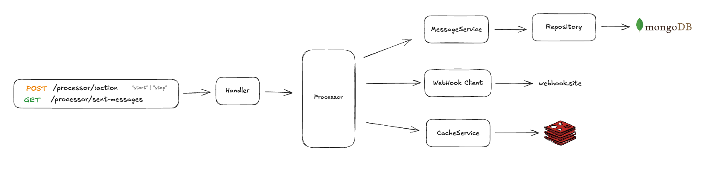

# Messaging System

A robust, scalable messaging system built with Go that processes and sends messages through webhook endpoints. The system features batch processing, Redis caching, MongoDB persistence, and a RESTful API for message management.


## Architecture

The system follows a clean architecture pattern with the following layers:

- **Handler**: HTTP request handling and routing
- **Processor**: Message batch processing and scheduling
- **Service**: Business logic layer
- **Repository**: Data access layer
- **Client**: External webhook communication
- **Cache**: Redis caching layer



## Prerequisites

- **Go**: 1.24.0 or higher
- **MongoDB**: 7.0.4 or higher
- **Redis**: 7.2 or higher
- **Docker & Docker Compose** (optional, for containerized deployment)

## Message Processing

The message processor runs in the background and:

1. Fetches unsent messages from MongoDB in batches (default: 2 messages)
2. Sends each message to the configured webhook endpoint
3. Updates message status to "sent" in MongoDB
4. Caches sent message information in Redis
5. Repeats every 2 minutes

### Message Status

- `unsent`: Message is pending to be sent
- `sent`: Message has been successfully sent

## Project Structure

```
.
├── .config/              # Configuration files
├── app/
│   ├── cache/           # Redis cache implementation
│   ├── client/          # Webhook client
│   ├── dto/             # Data transfer objects
│   ├── handler/         # HTTP handlers
│   ├── mocks/           # Mock implementations for testing
│   ├── model/           # Data models
│   ├── processor/       # Message processor
│   ├── repository/      # Database repository
│   └── service/         # Business logic
├── config/              # Configuration loader
├── Dockerfile           # Docker image definition
├── docker-compose.yml   # Docker Compose configuration
├── go.mod               # Go module dependencies
├── main.go              # Application entry point
└── Makefile             # Build and development commands
```

## Installation

### 1. Clone the Repository

```bash
git clone <repository-url>
cd messaging-system
```

### 2. Install Dependencies

```bash
go mod tidy
```

### 3. Configure Environment (sample)

Create or modify configuration files in `.config/` directory:

**Development** (`.config/dev.yaml`):
```yaml
appName: "messaging-system"

server:
  port: 80

client:
  url: "https://webhook.site"
  apiKey: "your-api-key"

mongo:
  uri: "mongodb://localhost:27017"
  database: "message"
  messageCollection: "messages"

redis:
  uri: "localhost:6379"
  password: ""
  db: 0
  ttl: 24h
```


### 4. Start Dependencies with Docker Compose

```bash
docker-compose up -d
```

This will start:
- MongoDB on port 27017
- Redis on port 6379

### 5. Run the Application

**Development Mode**:
```bash
make run
```

Or manually:
```bash
APP_ENV=dev go run main.go
```

**Production Mode**:
```bash
APP_ENV=prod go run main.go
```


## Development

### Build the Application

```bash
make build
```

### Run Tests

**Unit Tests**:
```bash
make unit-test
```

**Repository Tests** (requires Docker):
```bash
make repository-test
```

### Code Linting

```bash
make lint
```

### Generate Mocks

```bash
make generate-mocks
```

## Docker Deployment

### Build Docker Image

```bash
docker build -t messaging-system .
```

### Run with Docker Compose

```bash
docker-compose up -d
```


## API Endpoints

### Base URL
```
http://localhost:80
```

### 1. Start Message Processor

Starts the background message processor that sends unsent messages in batches.

**Endpoint**: `POST /processor/start`

**Response**:
```json
{
  "message": "message processor started"
}
```

**Example**:
```bash
curl -X POST http://localhost:80/processor/start
```

---

### 2. Stop Message Processor

Stops the background message processor.

**Endpoint**: `POST /processor/stop`

**Response**:
```json
{
  "message": "message processor stopped"
}
```

**Example**:
```bash
curl -X POST http://localhost:80/processor/stop
```

---

### 3. Get Sent Messages

Retrieves a list of sent messages with optional limit parameter.

**Endpoint**: `GET /processor/sent-messages`

**Query Parameters**:
- `limit` (optional): Number of messages to retrieve (default: 10)

**Response**:
```json
[
  {
    "id": "507f1f77bcf86cd799439011",
    "webhookMessageId": "webhook-msg-123",
    "phoneNumber": "+1234567890",
    "content": "Hello, this is a test message",
    "status": "sent",
    "sentAt": "2025-11-16T10:30:00Z"
  }
]
```

**Example**:
```bash
# Get 10 sent messages (default)
curl http://localhost:80/processor/sent-messages

# Get 20 sent messages
curl http://localhost:80/processor/sent-messages?limit=20
```

**Error Responses**:

- **400 Bad Request**: Invalid limit parameter
```json
{
  "error": "invalid limit parameter"
}
```

- **404 Not Found**: No sent messages found
```json
{
  "error": "no unsent messages found"
}
```

- **500 Internal Server Error**: Server error
```json
{
  "error": "error message details"
}
```